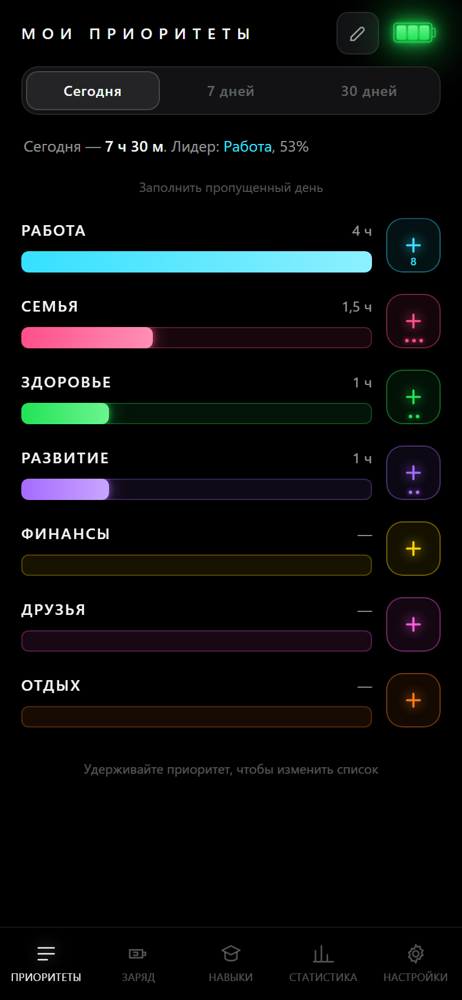
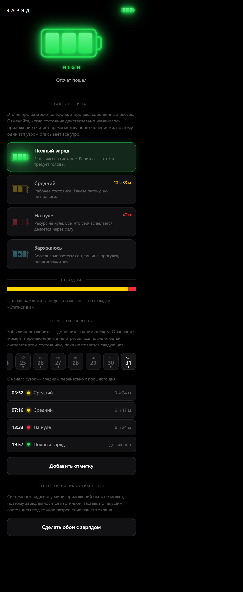
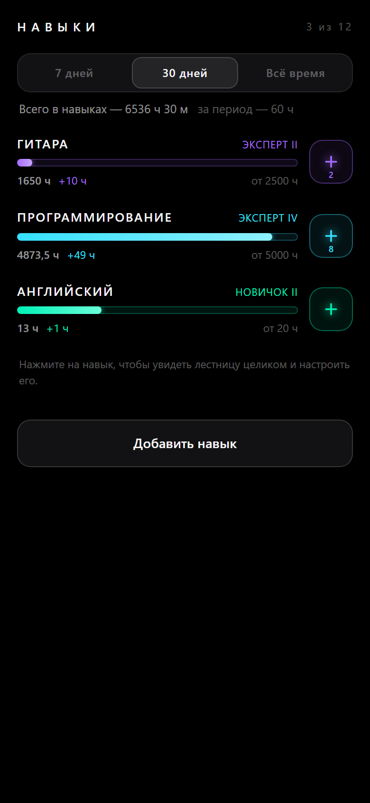
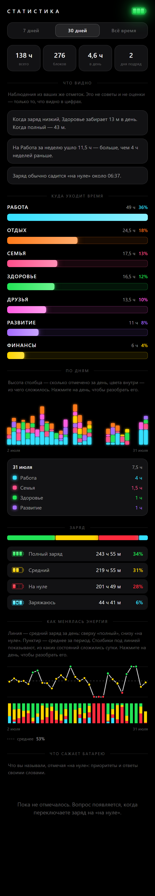

# My Priorities

**English** · [Русский](README.ru.md)

**My Priorities** is a Telegram Mini App about where your time and your personal
energy actually go.

Plans lie, tallies don't. It is for the person who reaches the end of the month
with a vague feeling — that work ate everything, that there was no time left for
family, that a skill has been “in progress” for two years — and who would rather
see the number than argue with the feeling. The app never advises how to live.
It shows how you live and lets you see the imbalance for yourself.

[**Open the app**](https://app.mypriorities.life) ·
[Landing page](https://mypriorities.life) ·
[Documentation (RU)](https://docs.mypriorities.life) ·
[Telegram bot](https://t.me/MyMainPriorityBot)

<p align="center">
  
  
  
  
</p>
<p align="center"><sub>Priorities · Charge · Skills · Statistics — the interface is Russian-only for now</sub></p>

**How it works.** You keep a list of directions: work, family, health, whatever
matters to you. Gave one a focused block of time — tap “+”. One tap is half an
hour of life invested into a direction; asking for exact minutes would turn
logging into a chore, and chores get abandoned within a week. Separately you mark
your own charge — full, medium, empty, recharging — and the app counts the time
between the switches. After a week the statistics screen shows two things at
once: **where the time went** and **in what state it went**. Four hours of work
on a full charge and four hours on an empty one are not the same four hours.

On top of that — a skills ladder that counts hours toward mastery, and
achievements. Both can be switched off; the app returns to its core.

**No account, no sign-up.** You open it and you are already working: no email, no
password, no onboarding funnel — the first tap happens ten seconds after the
first launch. That matters beyond convenience: this history is a record of how
you actually spend your life, and it stays on your device. Nothing is sent
anywhere, and the app knows nothing about you — not your email, not your name,
not an identifier. Signing in through Telegram is needed only if you want the
same history on a second device. It works inside Telegram and, just as well, in
an ordinary browser.

## Stack

| Layer | What is used | Notes |
|---|---|---|
| App | React 18, TypeScript, Vite | Runtime dependencies: `react`, `react-dom` and — as the single exception — `modern-screenshot` inside the debug panel, where it arrives as a separate lazy chunk ([details](docs/dev/devkit.md)). No router, no state manager, no chart or drag-and-drop library |
| State | One `useReducer` in a context | Optimistic writes: the interface changes immediately, storage catches up with a delay |
| Storage | IndexedDB | An operation log is the source of truth, not ready totals |
| Sync | Cloudflare Worker + D1 | Optional. Telegram sign-in (a silent signature inside the Mini App, OAuth with PKCE in a browser), JWT sessions, server-side compaction of the old log ([`worker/`](worker/)) |
| Graphics | Bare SVG and Canvas | Charts, the neon battery and the wallpaper renderer are all hand-written |
| Docs | VitePress | A page per screen plus topic pages, its own `package.json` and its own deploy |
| Landing | Vite, no framework | Design tokens and frames are synced from the app by a script |
| Tooling | Playwright, Node scripts | Documentation screenshots, app icons and favicons, the ticket CLI |
| Tests | Vitest, fake-indexeddb | Domain logic and log merging, plus guard tests over the docs, the tokens and the dependencies |
| Delivery | Vercel (app, docs, landing), Cloudflare (Worker, D1, KV) | Four projects deployed independently |

The visual language comes from [references/](references/): pure black background,
a neon three-segment battery, a caption in wide-tracked caps between two thin
lines. The app is deliberately dark-only.

**Localization.** Not a single line of interface text sits inside a component:
everything lives in [`src/i18n/ru.ts`](src/i18n/ru.ts) behind an i18n layer with
its own plural rules. The app speaks Russian today; an English version is
planned, and it means adding one file rather than going through the components.

## Engineering notes

**Local-first, with offline as the normal state.** History is stored as
intentions — “plus a block”, “minus a block” — rather than as ready totals.
Addition is commutative, so delivery order does not matter; every operation has
an id, so a repeated delivery changes nothing; removing a block is a negative
term instead of a special case. Every operation is stamped with a
[hybrid logical clock](docs/dev/architecture.md), because a wall clock read from
a phone with the wrong date would win — or lose — forever. The server never
merges: it is storage and a cursor, and the client folds operations into state
with the very same pure function it uses locally, so the merge rules have exactly
one implementation. See [data and sync](docs/topics/data.md).

**“No libraries” as a promise a machine keeps.** It is a calculation, not a
principle: every dependency is kilobytes in a bundle loaded inside a phone
webview, and one more thing that can break when the Telegram client updates.
Reordering is a ~120-line Pointer Events hook; the charts are bare SVG.
[`tools/deps.test.ts`](tools/deps.test.ts) fails the build if a runtime
dependency appears that the documentation does not name — and it also holds
[`src/devkit/`](src/devkit/) to importing nothing outside itself, so the panel
stays copy-pasteable into another project.

**Bug reports from inside the running app.** `Ctrl` + `Shift` + `Q`, or a
three-finger hold on a phone, reveals the debug panel: select a region of the
live screen, draw on top of it, describe it in words, send. The ticket lands in
D1 together with the frame and the technical context of that moment; later
`npm run tickets:pull` brings tickets into `.tickets/`, where an AI agent picks
them up ([details](docs/dev/devkit.md)).

**A style guide that cannot drift.** `?brand` opens a screen that renders the
real components and **parses** `tokens.css` and every app stylesheet instead of
retelling them. Delete a token and its swatch disappears; introduce a size
outside the scale and a line shows up in the list of exceptions.

**Documentation is part of the delivery.** A dedicated test walks the docs tree
for broken links, orphan pages and missing screenshots: a divergence between the
docs and the code should be caught there, not by a reader six months later. What
it deliberately does not check is whether the prose matches the behaviour — that
cannot be verified, and an imitation of the check is more dangerous than its
absence.

**Screenshots and icons are generated, not collected by hand.** Playwright walks
the app through scripted scenarios — every frame in the documentation and on the
landing page, plus the whole icon set, the favicons and the link preview.

## Documentation

**Every screen, every feature, every scenario and edge case is described in
detail on the documentation site: [`docs/`](docs/)** — in Russian.

```bash
npm run docs:dev
```

That is where to start: [what this is](docs/guide/what.md),
[quick start](docs/guide/quick-start.md),
[architecture](docs/dev/architecture.md),
[data and sync](docs/topics/data.md),
[how to maintain the docs](docs/dev/docs.md).

## Commands

```bash
npm install
npm run dev          # http://localhost:5173
npm run dev          # + ?mock=1 or ?demo=max — demo profiles, writing disabled
npm run test         # app logic and documentation coherence
npm run build        # tsc --noEmit + build into dist/

npm run docs:dev     # documentation site
npm run docs:build

npm run landing:dev  # landing page
npm run landing:build
npm run landing:sync # refresh the copies of tokens and frames in landing/

npm run shots:setup  # once: playwright + chromium
npm run docs:shots   # rebuild the documentation screenshots
npm run brand        # rebuild the icons, the favicons and the link preview

npm run devkit:sync  # rebuild the debug panel for the docs and the landing page
npm run tickets:list # tickets from the built-in debug panel
npm run tickets:pull # pull them into .tickets/ — that is where the AI reads them
npm run tickets:close -- <id> "what was done"
```

## Layout

```
src/
  i18n/          interface strings and plural rules
  domain/        types, palette, dates, presets, aggregation, observations
  store/         storage schema, serialization, store with deferred writes
  telegram/      a wrapper around WebApp and key-value storage
  components/    battery, priority row, sheet, charts, reordering
  demo/          “show a friend” profiles and their generator
  screens/       ten screens
  skills/        the ladder of levels, hour counting, skill row and sheet
  achievements/  registry, precomputation, granting, card to share
  wallpaper/     canvas rendering and saving
  sync/          operation log, stamps, exchange with the server, one-time migration
  platform/      the session and whatever differs between a browser and the wrapper
  devkit/        the portable debug panel: frame, annotation, ticket

worker/          sync server and tickets (Cloudflare Worker + D1, own package.json)
docs/            documentation site (VitePress, own package.json and deploy)
landing/         public page of the app (Vite, own package.json and deploy)
tools/shots/     screenshot and icon generator (Playwright)
tools/tickets/   command line for debug-panel tickets (node only)
public/          PWA manifest, icons, service worker — built by `npm run brand`
```

`tsconfig.json` only includes `src`, so `docs/`, `landing/`, `worker/` and
`tools/` never reach the app build, while VitePress, the landing page's Vite,
wrangler and Playwright live in their own `package.json` files — the root
install does not grow because of them. Each of those directories is deployed as
a separate project.

## Privacy and security

**Nothing leaves the device until you sign in.** No email, no name, no
identifier — there is simply nothing to leak. No analytics, no trackers and no
third-party scripts, apart from Telegram's own `telegram-web-app.js`, which the
platform requires.

**If you do sign in, the server holds your log and nothing more.** The operation
log, your settings and your skills catalogue, tied to a Telegram id — the same
data your device already has, kept so that a second device can catch up. Old
operations are collapsed into monthly totals; the sums survive, the detail does
not.

**No secrets in the bundle.** A Mini App runs entirely on the client, so
everything it carries is public by definition. The bot token is never needed
there: it only signs server-side Bot API calls, it lives as a Cloudflare secret
next to the Worker, and it is not in this repository — see [`worker/`](worker/)
for the full list of what the server expects.

## License

[MIT](LICENSE).
